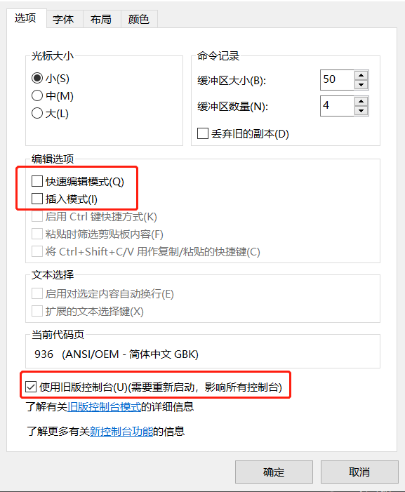
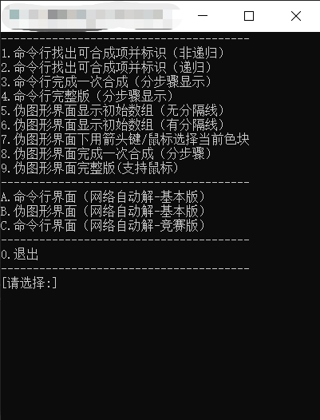
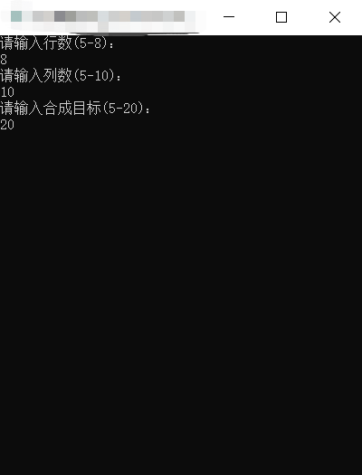
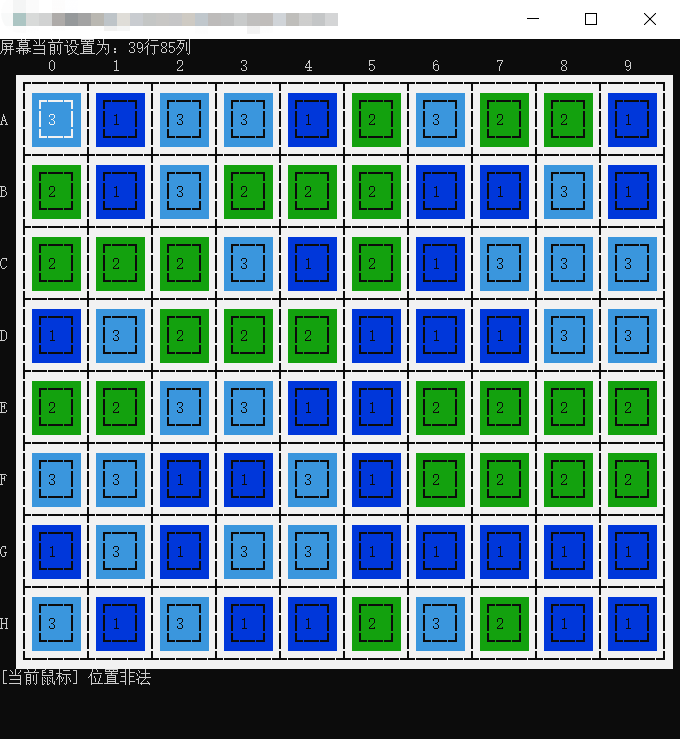
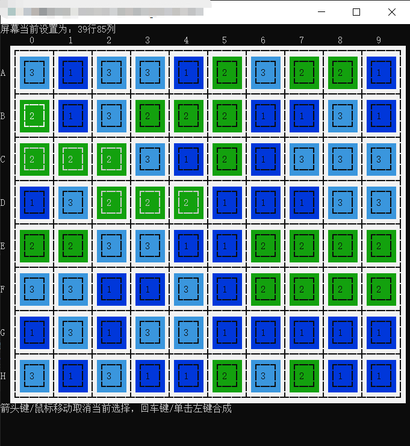
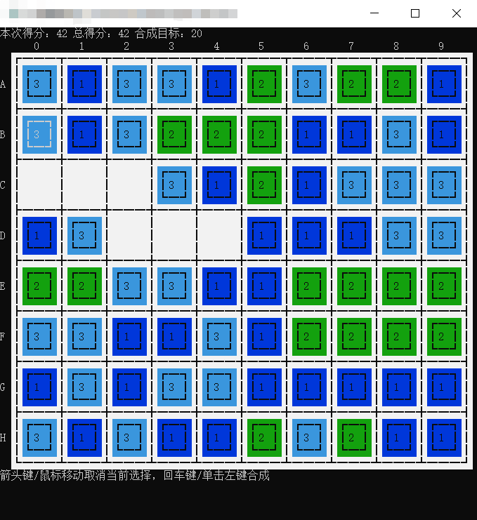
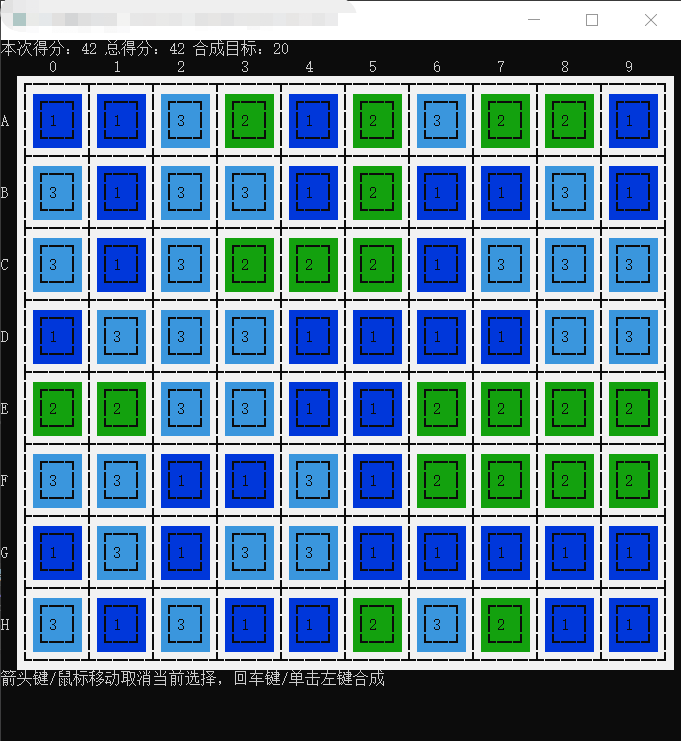

# Merge2Ten

## 项目简介

详情见 `21221-900102-W1401. 综合题 - 第02题 - 合成十游戏.pdf`

## 项目结构

项目包含以下文件：

```
├── 90-b2.h                 # 公共声明部分及其他所需内容
├── cmd_console_tools.h     # 伪图形界面头文件
├── lib_mto10_net_tools.h   # 进行网络传输的头文件
│
├── cmd_console_tools.cpp   # 伪图形界面源文件
├── 90-b2-tools.cpp         # 内部数组和伪图形界面的公用函数
├── 90-b2-base.cpp          # 内部数组方式实现的各函数
├── 90-b2-console.cpp       # 伪图形界面方式实现的各函数
├── 90-b2-main.cpp          # 主函数及菜单部分函数
├── 90-b2-net.cpp           # 网络版对应的各函数
│
├── lib_md5_sha_tools.lib   # 用于加密用户密码的静态库
├── lib_mto10_net_tool.lib  # 用于进行网络传输的静态库
│
├── 90-b2.exe               # 可执行程序
│
├── README.md               # 项目说明文档
└── images                  # 文档需要的图片
    ├── ...
    └── ...
```

网络自动解版本连接的是学校的服务器

**网络自动解版本已不可使用**

## 如何运行

**方法一：**

直接运行 `90-b2.exe` 可执行程序

**方法二：**

在 `Visual Studio` 中以 `Debug x86` 模式运行 `90-b2-main.cpp` 文件

**说明**

为了使程序正常运行，请对控制台做出如下设置：



程序正常运行后出现如下菜单界面：



**以伪图形界面完整版为例**

开始游戏后出现如下界面：



输入游戏设置后出现如下伪图形界面：



鼠标移动选择想要合并的区域：



单击左键进行合并：



空白区域上方格子下落，下落后的空白区域随机生成新的格子：


